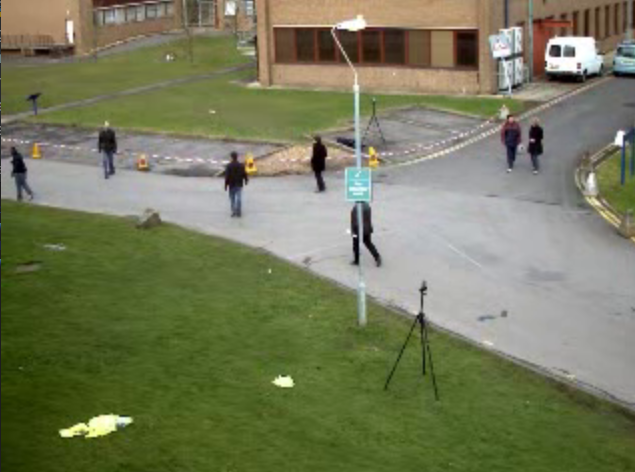
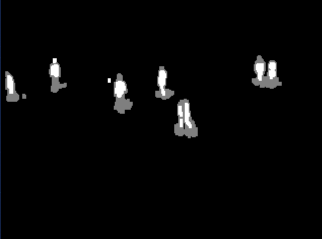
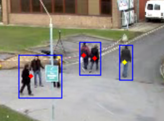

# Procesamiento de imágenes

Este trabajo realiza un procesamiento de imágenes a partir de aplicar 4 etapas, comenzando por la sustracción del fondo, luego detección de blobs, clasificación de los mismos y seguimiento

## Sustracción de fondo

La sustracción de fondo es un método utilizado para la detección de objetos en movimiento a partir de cámaras estáticas (es decir, cámaras sin movimiento aparente). Esta etapa de procesamiento resulta crucial en aplicaciones en las que es necesario detectar movimiento, identificar y/o realizar el seguimiento de objetos en imágenes dinámicas. Este método puede encontrarse también bajo el nombre Extracción de primer plano (Foreground extraction en inglés). El método permite seccionar la imagen en zonas que aparecen estáticas (fondo) y zonas que presentan movimiento (frente).

Imagen original

Imagen sin fondo

## Detección de blobs

Esta etapa devuelve un conjunto de rectángulos, los cuales contienen la información suficiente para ejecutar la siguiente etapa

## Clasificación de blobs

Los blobs pueden ser clasificados como útiles o como no útiles. Un blob útil es aquel para el cual se puede asegurar, con cierto grado de certeza, que contiene un objeto de interés. Los blobs que no son clasificados como útiles son descartados, ya que se asume que no contienen objetos de interés y por lo tanto no aportan información relevante para las siguientes etapas del sistema.

Clasificación de blobs como personas

## Seguimiento

La etapa de seguimiento de objetos de interés (tracking, en inglés) es la encargada de realizar el seguimiento de la posición de los objetos de interés a través del tiempo. Para efectuar esa tarea, el algoritmo implementado determina las correspondencias uno a uno, entre los blobs detectados en un frame t y los objetos de interés presentes en el frame anterior, t-1.