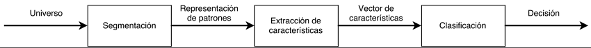

# Detección de patrones

Un sistema de detección de patrones consiste en particionar un universo de estudio en clases, de manera que el sistema sea capaz de asignar un elemento x a alguna de las clases, a partir de un conjunto de características que presenta el modelo del elemento. A cada clase se le asignan elementos que cumplen características semejantes entre ellos; estas características cumplen con lo que se denomina patrón de características.

La detección de patrones generalmente se compone de tres etapas junto a la entrada y salida de cada una. Las etapas son segmentación, extracción de características y clasificación. En ocasiones existe una etapa previa a las tres presentadas, llamada preprocesamiento, donde se opera con los datos de forma tal de reducir sus dimensiones, normalizarlos o eliminar el ruido presenta a la hora de la obtención.

Etapas del reconocimiento de patrones

## Segmentación

Para el caso de este sistema, en la etapa de segmentación se reciben las imágenes y se extraen los objetos de interés que presenta, el resto de la imagen se desecha. La etapa de segmentación es similar a la etapa de sistemas de procesamiento de imagen.

## Extracción de características

La etapa de extracción y selección de características toma como datos de entrada los resultados de la etapa de segmentación. Esta etapa analiza los objetos dados como entrada, con el fin de extraer características relevantes de éstos. Las características extraídas pueden ser cuantitativas (velocidad, distancia, etc.) o cualitativas (profesión, sexo, etc.) y son utilizadas para construir un vector llamado vector de características.

## Clasificación

En la etapa de clasificación se procesa el vector de características con el fin de tomar la decisión más acertada, es decir, se busca asignar al vector de características la clase más adecuada. Por lo general, la elección de un clasificador depende de la naturaleza del problema.